# MusicSync

一个基于 Docker 部署的自托管 Web 音乐服务。项目本身不内置任何音源，通过接入第三方自定义音源实现播放，完整兼容洛雪音乐（LX Music）生态，既可以作为洛雪客户端的同步服务端，也可以直接在浏览器里当成独立音乐 App 使用。

现在的 MusicSync 已经不只是“网页听歌壳子”，而是把搜索、播放、缓存、下载、订阅、Telegram 交互、多用户管理、备份恢复这些链路都补齐了，适合长期部署和多人共用。

---

## 当前版本亮点

- 新增 Bilibili 和 YouTube Music 搜索，很多国内平台没有的歌手、翻唱、现场版、搬运音频现在也能直接搜到
- Telegram Bot 与通知中心做了完整升级，可以在 TG 里直接搜索、下载、订阅，也能收到登录提醒、新歌发现、下载完成等通知
- 订阅能力继续增强，支持歌手、专辑、歌单订阅，后台会异步检查更新并自动下载
- 缓存和下载逻辑整体重做，首首歌冷启动会稍慢一点，但连续播放命中缓存后基本无感
- 新增下载管理、缓存管理、下载前询问弹窗，下载方式、音质、歌词是否保存都能细调
- 新增多用户、账号中心和管理后台，适合家庭成员或小团队共用一套服务
- 新增 WebDAV 备份 / 恢复、全局备份和用户快照，迁移、备份和误操作恢复更方便
- Docker 支持把缓存目录独立挂载到自定义路径，可自由映射到 SSD、NAS 或其他宿主机目录
- 继续保留洛雪音乐同步服务端能力，歌单、收藏和播放列表可以继续和 LX 客户端联动

---

## 核心能力

### 音乐搜索与播放

- 不内置任何版权内容，所有播放能力均来自用户自行配置的第三方自定义音源
- 完整兼容洛雪音乐自定义源协议，可直接接入社区现有的 LX Music 源
- 支持酷我、酷狗、QQ 音乐、网易云、咪咕、Bilibili、YouTube Music 等多平台聚合搜索
- 支持排行榜、歌单分类、歌手页等常用入口，海外和国内内容能放到同一套搜索体验里
- 多源同时配置时可自动切换，某个源失败后会自动尝试下一个可用源
- 支持 FLAC、FLAC24BIT、320K 等音质展示与筛选
- 支持歌词同步、歌词页、歌词卡片分享、亮色 / 深色模式和移动端 PWA 安装体验

### 缓存、下载与连续播放

- 播放链路包含浏览器本地缓存和服务器缓存两层，兼顾首次加载和后续连续播放体验
- 首次播放会先做必要解析与缓存准备，后续命中缓存后切歌基本无感
- 新增下载管理页，支持进度、速度、状态、批量管理和完成态保留显示
- 新增缓存管理页，可查看已缓存歌曲、缓存统计、清理策略和服务器缓存记录
- 下载前支持询问弹窗，可选择浏览器下载或服务器落盘下载，并设置目标音质、歌词文件等选项
- 支持 YouTube 直连下载，后端可自动拉起 yt-dlp 处理下载任务

### 订阅、通知与自动化

- 支持按歌手、专辑、歌单建立订阅
- 订阅检查与自动下载已改为后台异步任务，不会长时间阻塞前端页面或接口请求
- 可查看订阅运行状态、扫描进度、下载状态，也支持手动触发检查或停止当前任务
- Telegram Bot 支持搜索、下载、订阅、查看订阅列表、手动检查订阅更新等交互命令
- 通知中心支持登录提醒、订阅扫描、新歌发现、下载完成等多类通知

### 多用户、同步与数据安全

- 支持多用户登录，每个用户独立管理自己的歌单、收藏、历史、设置和订阅
- 提供账号中心、头像资料编辑、用户组与权限控制能力
- 提供管理后台仪表盘，可查看运行时间、内存占用、目录大小、最近操作记录等
- MusicSync 可作为洛雪音乐客户端同步服务端使用
- 支持用户级快照，可在误操作后快速回滚关键数据
- 支持 WebDAV 备份、恢复、自动备份、备份数量限制、远程备份列表查看等能力
- 管理员还可以做全局 WebDAV 备份与恢复，适合整套服务迁移

---

## 截图预览

下面这组截图里，已经包含这次新增的 5 张图片：Bilibili 搜索、YouTube 搜索、TG 搜索下载、TG 添加订阅、多用户管理与服务器同步。

<table>
  <tr>
    <td align="center"><b>搜索首页</b></td>
    <td align="center"><b>Bilibili 搜索</b></td>
    <td align="center"><b>YouTube Music 搜索</b></td>
    <td align="center"><b>排行榜</b></td>
  </tr>
  <tr>
    <td>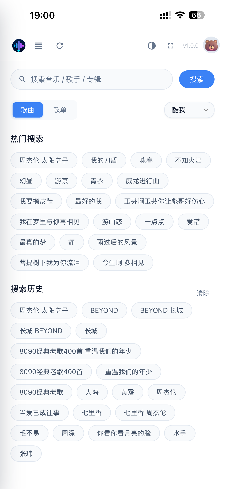</td>
    <td>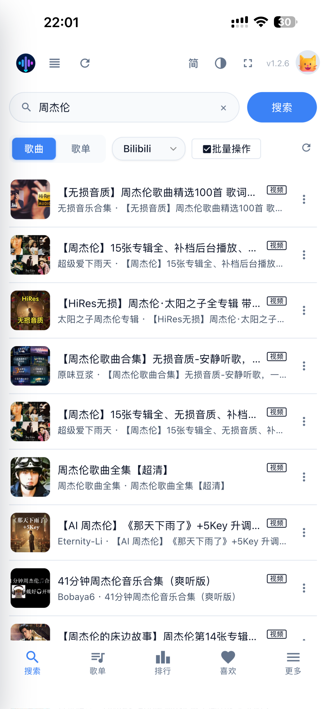</td>
    <td>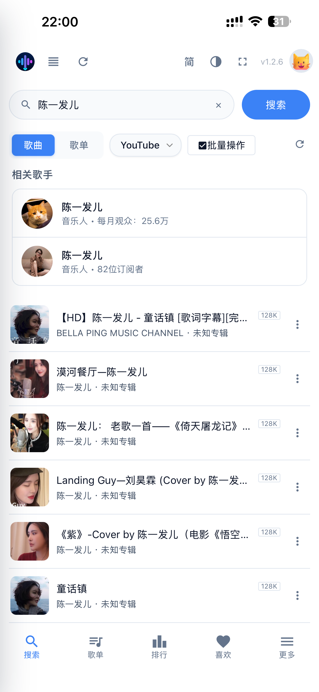</td>
    <td>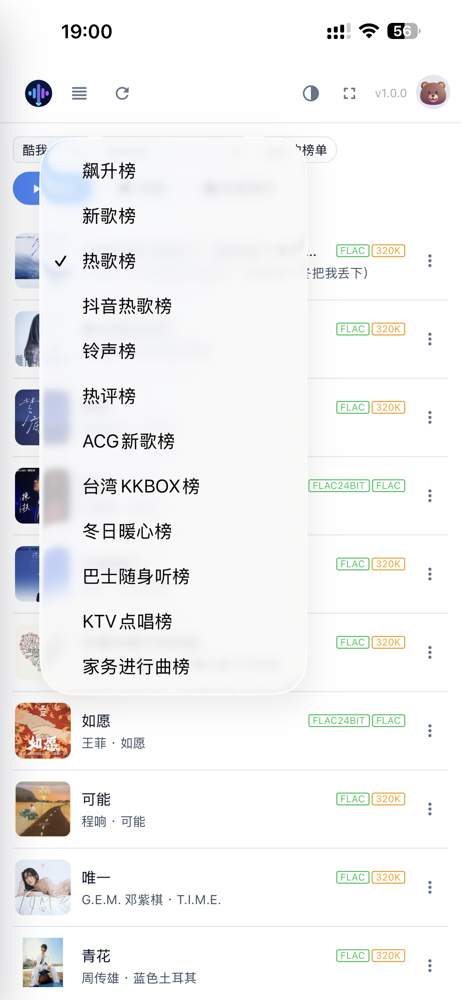</td>
  </tr>
  <tr>
    <td align="center"><b>歌单分类</b></td>
    <td align="center"><b>播放器</b></td>
    <td align="center"><b>歌词页面</b></td>
    <td align="center"><b>歌词卡片分享</b></td>
  </tr>
  <tr>
    <td></td>
    <td>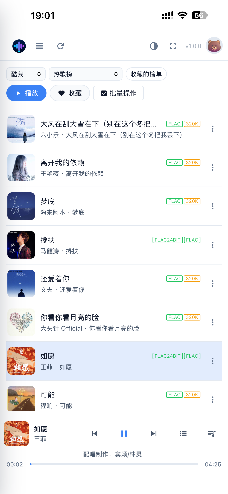</td>
    <td>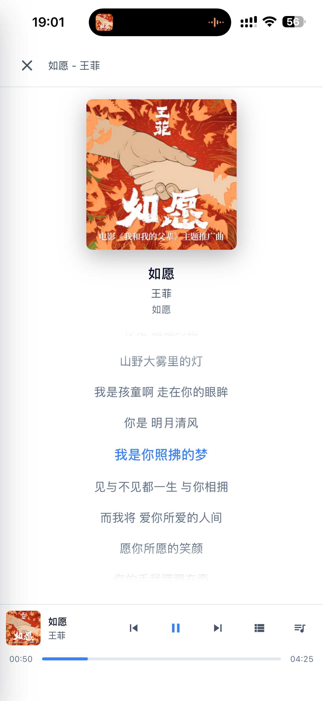</td>
    <td>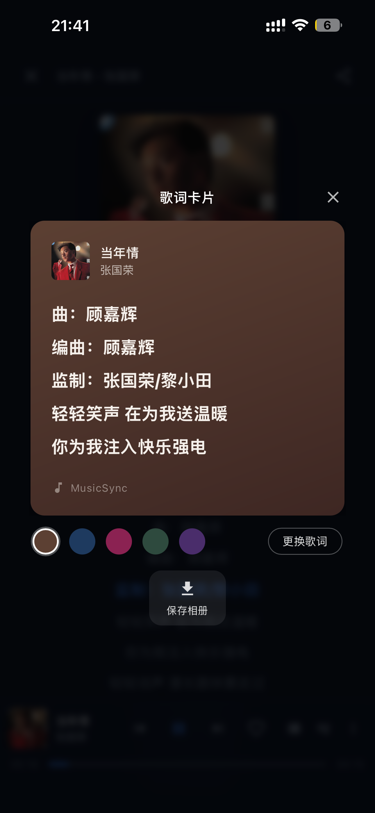</td>
  </tr>
  <tr>
    <td align="center"><b>TG 命令搜索下载</b></td>
    <td align="center"><b>TG 命令添加订阅</b></td>
    <td align="center"><b>缓存中心</b></td>
    <td align="center"><b>管理员仪表盘</b></td>
  </tr>
  <tr>
    <td>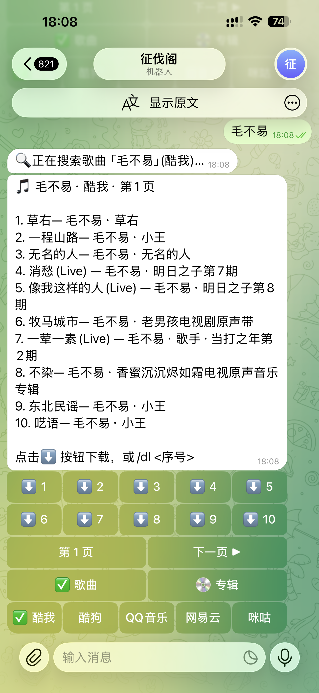</td>
    <td>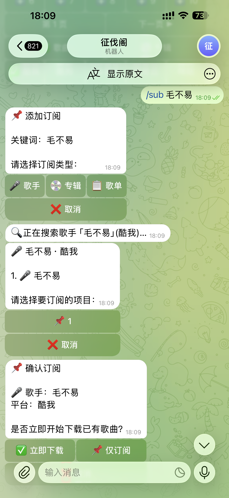</td>
    <td>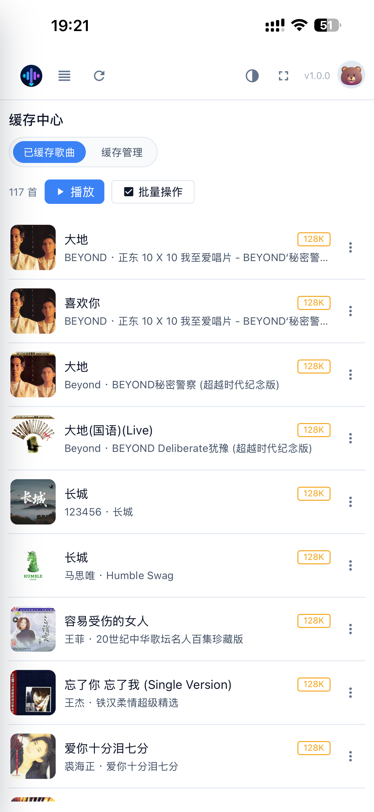</td>
    <td>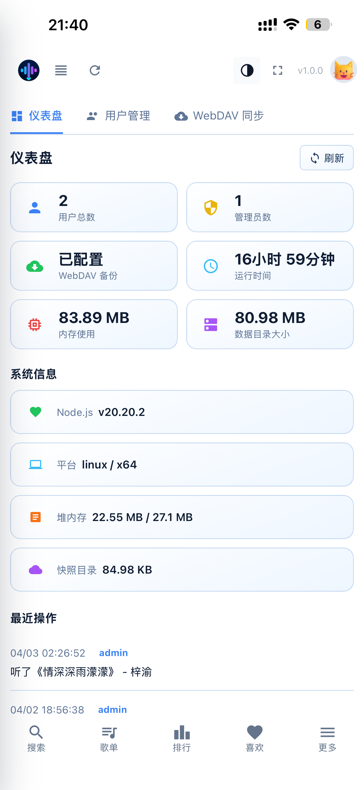</td>
  </tr>
  <tr>
    <td align="center"><b>多用户管理 + 服务器同步</b></td>
    <td align="center"><b>用户管理 & 同步地址</b></td>
    <td align="center"><b>深色模式</b></td>
    <td align="center"><b>平台选择</b></td>
  </tr>
  <tr>
    <td>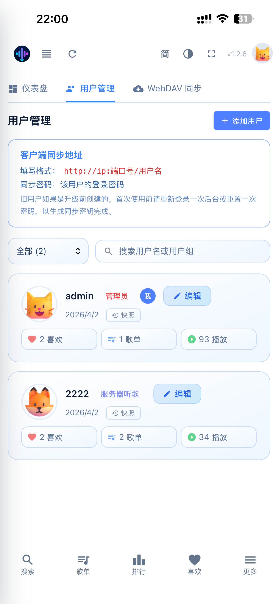</td>
    <td>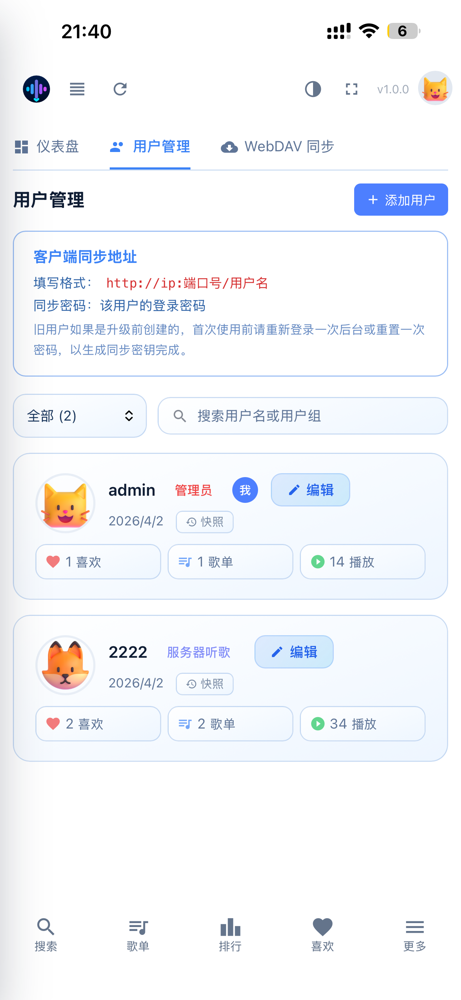</td>
    <td>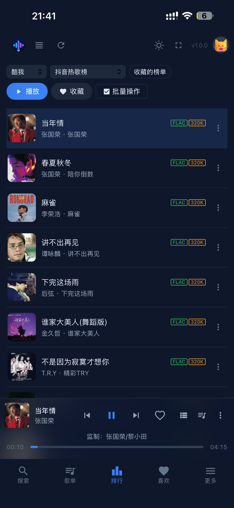</td>
    <td>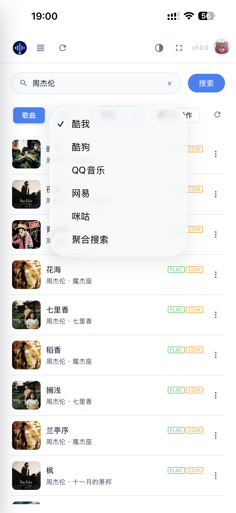</td>
  </tr>
</table>

---

## 快速开始（Docker 部署）

### 前置条件

- 已安装 [Docker](https://docs.docker.com/get-docker/) 和 [Docker Compose](https://docs.docker.com/compose/install/)
- 已准备兼容洛雪协议的第三方自定义音源地址

### 1. 准备配置文件

直接使用本仓库自带的 [docker-compose.yml](./docker-compose.yml) 即可，也可以复制下面这份最小配置：

```yaml
version: "3.8"
services:
  musicsync:
    image: lincolnpark2000/musicsync:latest
    container_name: musicsync
    restart: unless-stopped
    ports:
      - "5566:5566"
    environment:
      - PORT=5566
      - NODE_ENV=production
      - DATA_DIR=/app/data
      - DOWNLOAD_DIR=/app/downloads
      - CACHE_DIR=/app/cache

      # 可选：为自定义音源单独设置出口代理
      # - USER_API_PROXY=http://your-proxy:port
      # 可选：通用代理（仅在必要时设置）
      # - HTTP_PROXY=http://your-proxy:port
      # - HTTPS_PROXY=http://your-proxy:port
      # - NO_PROXY=127.0.0.1,localhost,musicsync
    volumes:
      - musicsync_data:/app/data
      - musicsync_downloads:/app/downloads
      - musicsync_cache:/app/cache

volumes:
  musicsync_data:
  musicsync_downloads:
  musicsync_cache:
```

### 2. 启动服务

```bash
docker compose up -d
```

### 3. 打开网页

浏览器访问 `http://localhost:5566`，或替换成你实际映射的端口。

手机端可直接用浏览器打开后添加到主屏幕，作为 PWA 独立安装使用。

### 4. 首次进入后的建议流程

1. 创建管理员账号并登录
2. 到“设置 → 自定义音源”添加兼容洛雪协议的音源地址
3. 按需配置下载目录、缓存策略、通知、Telegram Bot、WebDAV 备份等高级功能

---

## 自定义音源配置

> MusicSync 本身不能直接提供任何音乐内容，必须先配置自定义音源后才能播放。

### 添加方式

1. 打开 MusicSync 网页
2. 进入“设置 → 自定义音源”
3. 填入兼容洛雪协议的音源 URL 并保存

### 多源自动切换

支持同时维护多个音源地址。某个音源获取失败时，系统会自动切换到下一个可用源，无需手动重试。

### 兼容协议

兼容 [洛雪音乐自定义源](https://github.com/pdone/lx-music-source) 协议，社区现有 LX Music 源通常可以直接接入。

---

## Telegram Bot 可以做什么

完成 Bot Token 和 Chat ID 配置后，可以把 Telegram 当成 MusicSync 的一个远程入口：

- 直接在 TG 里搜索歌曲、下载歌曲、添加订阅
- 查看订阅列表，手动触发订阅检查
- 接收登录提醒、订阅扫描状态、新歌发现、下载完成等通知

常用指令示例：

```text
/start
/help
/search 周杰伦 稻香
/download 周杰伦 稻香
/sub 歌手 Taylor Swift
/sub_check
```

---

## 洛雪音乐客户端同步

MusicSync 可作为洛雪音乐（LX Music）的数据同步服务端，在洛雪客户端中填写以下信息即可同步：

| 字段 | 填写内容 |
|------|----------|
| 同步地址 | `http://IP:端口号/用户名` |
| 同步密码 | 当前用户的登录密码 |

旧用户如果是在较早版本创建的，首次使用同步前建议重新登录一次后台，或者在后台重置一次密码，以生成新的同步密钥。

---

## 环境变量说明

| 变量名 | 默认值 | 说明 |
|--------|--------|------|
| `PORT` | `5566` | 服务监听端口 |
| `NODE_ENV` | `production` | 运行环境 |
| `DATA_DIR` | `/app/data` | 数据目录，存放用户数据、配置、快照等 |
| `DOWNLOAD_DIR` | `/app/downloads` | 下载文件保存目录 |
| `CACHE_DIR` | `/app/cache` | 服务器缓存目录，可独立映射到单独磁盘路径 |
| `USER_API_AUTO_REFRESH` | `1` | 是否自动刷新自定义音源 |
| `USER_API_AUTO_REFRESH_INTERVAL_MINUTES` | `180` | 自动刷新音源间隔（分钟） |
| `USER_API_PROXY` | 空 | 仅给自定义音源请求使用的出口代理 |
| `HTTP_PROXY` / `HTTPS_PROXY` | 空 | 全局代理，只有确实需要时再设置 |
| `NO_PROXY` | 空 | 代理白名单，例如 `127.0.0.1,localhost,musicsync` |

---

## 数据持久化与缓存目录挂载

默认配置使用 Docker 具名卷，适合先快速跑起来。

如果你希望把数据、下载和缓存分别放到宿主机不同目录，可以改成 bind mount：

```yaml
services:
  musicsync:
    environment:
      - DATA_DIR=/app/data
      - DOWNLOAD_DIR=/app/downloads
      - CACHE_DIR=/app/cache
    volumes:
      - /your/path/data:/app/data
      - /your/path/downloads:/app/downloads
      - /your/path/cache:/app/cache
```

这意味着缓存目录现在可以单独挂到 SSD、NAS 或任意宿主机路径，不再必须和数据目录绑在一起。对于大量连续播放或高频下载的场景，这个改动会更实用。

---

## 适合的使用场景

- 想要一个能在手机浏览器和桌面浏览器直接使用的自托管音乐服务
- 想把洛雪音乐客户端的同步服务收回到自己服务器管理
- 想通过 Telegram 远程搜索、下载、订阅音乐内容
- 想长期维护自己的收藏、歌单、缓存、下载和备份体系
- 想让家庭成员或小团队共用同一套服务，但各自数据彼此隔离

---

## 注意事项

- 本项目不提供、不内置、不分发任何受版权保护的音乐内容
- 自定义音源由用户自行配置，相关内容的合规性由用户自行判断和承担
- 项目仅用于学习、研究和个人技术实践

---

## License

[MIT](./LICENSE)
