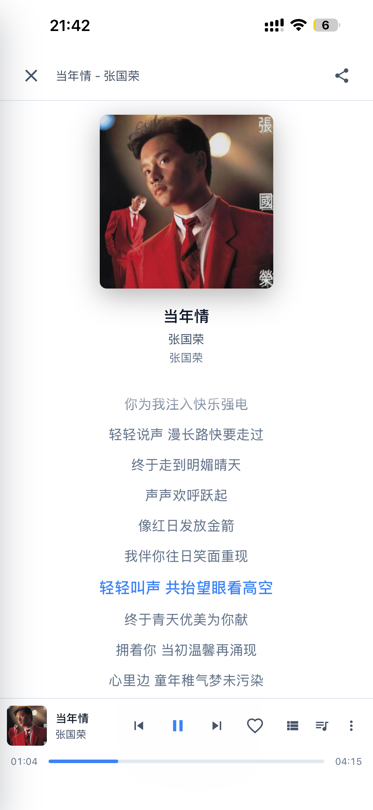

# MusicSync

一个基于 Docker 部署的 **自托管 Web 音乐服务**，**本身不内置任何音乐源**，通过接入第三方自定义音源实现音乐播放。完全兼容**洛雪音乐（LX Music）**生态——既可作为洛雪客户端的**同步服务端**保存你的歌单与收藏，也可直接在浏览器中当作独立的**手机 App** 使用，拥有 PWA 安装支持、多用户管理、WebDAV 备份等一系列功能。

---

## 功能特点

### 🎵 音乐播放
- **无内置源**：不提供任何音乐版权内容，所有播放能力来自用户自行配置的第三方自定义源
- **兼容洛雪源**：完整支持 LX Music 自定义源协议，可直接导入社区现有的源
- **多源聚合 & 自动切换**：同时配置多个源后，播放失败时自动切换到下一个可用源
- **本地缓存**：播放过的歌曲自动缓存，再次播放直接读取缓存，省流量、响应更快
- **高音质**：支持 FLAC / FLAC24BIT / 320K 等多种音质显示与筛选
- **歌词同步**：播放界面实时滚动歌词，歌曲信息一目了然

### 🔍 发现音乐
- **多平台搜索**：支持酷我、酷狗、QQ 音乐、网易云、咪咕等平台聚合搜索
- **排行榜**：浏览各平台热歌榜、新歌榜、抖音榜等多个榜单
- **精选歌单**：支持按专区分类筛选（网红专区、经典老歌、DJ、国风、影视等）

### 📱 手机 App 体验（PWA）
- 针对手机端全面优化显示效果，界面简洁美观
- Docker 部署后用手机浏览器访问，**添加到主屏幕**即可获得原生 App 体验
- 支持亮色 / 深色模式，深色模式经过精心优化，界面更美观

### 🔄 洛雪音乐客户端同步
- MusicSync **可作为洛雪音乐的同步服务端**，洛雪客户端的歌单、收藏、播放列表均可同步保存到本服务
- 同步地址格式：`http://IP:端口号/用户名`，同步密码为该用户的登录密码
- 旧用户首次使用前，需重新登录一次后台或重置密码，以生成同步密钥

### 👥 多用户管理
- 支持创建多个用户，每个用户独立管理自己的歌单、收藏和播放历史
- 管理员可查看所有用户的喜欢数、歌单数、播放次数等统计信息
- 支持用户角色区分（管理员 / 服务器听歌等）
- 提供搜索过滤、用户编辑等管理功能

### 🛡️ 数据安全（WebDAV 备份 & 快照）
- 支持为每个用户配置 WebDAV 备份，自动将数据备份到 NAS 或云存储
- 支持一键创建数据**快照**，随时恢复到历史状态，保护数据安全
- 管理后台**仪表盘**实时展示运行时间、内存占用、数据目录大小、最近操作记录等

### 🎴 歌词卡片分享
- 播放时支持生成**歌词卡片**，展示当前歌词片段、专辑封面及曲目信息
- 可选多种卡片主题配色，一键**保存到相册**或分享出去

---

## 截图预览

<table>
  <tr>
    <td align="center"><b>搜索页面</b></td>
    <td align="center"><b>平台选择</b></td>
    <td align="center"><b>排行榜</b></td>
    <td align="center"><b>歌单分类</b></td>
  </tr>
  <tr>
    <td></td>
    <td></td>
    <td></td>
    <td></td>
  </tr>
  <tr>
    <td align="center"><b>播放器</b></td>
    <td align="center"><b>歌词页面</b></td>
    <td align="center"><b>歌词卡片分享</b></td>
    <td align="center"><b>深色模式</b></td>
  </tr>
  <tr>
    <td></td>
    <td></td>
    <td></td>
    <td></td>
  </tr>
  <tr>
    <td align="center"><b>用户管理 & 同步地址</b></td>
    <td align="center"><b>管理员仪表盘</b></td>
    <td align="center"><b>缓存中心</b></td>
    <td align="center"><b>歌词页面（亮色）</b></td>
  </tr>
  <tr>
    <td></td>
    <td></td>
    <td></td>
    <td></td>
  </tr>
</table>

---

## 快速开始（Docker 部署）

### 前置条件

- 已安装 [Docker](https://docs.docker.com/get-docker/) 和 [Docker Compose](https://docs.docker.com/compose/install/)
- 自行准备兼容洛雪协议的第三方自定义音源地址

### 1. 下载配置文件

```bash
# 下载 docker-compose 配置
curl -O https://raw.githubusercontent.com/your-username/musicsync/main/docker-compose.yml
```

或者直接复制以下内容保存为 `docker-compose.yml`：

```yaml
version: "3.8"
services:
  musicsync:
    image: lincolnpark2000/musicsync:latest
    container_name: musicsync
    restart: unless-stopped
    ports:
      # 左侧改为你想要的端口号
      - "5566:5566"
    environment:
      - PORT=5566
      - NODE_ENV=production
      - DATA_DIR=/app/data
      - DOWNLOAD_DIR=/app/downloads
      # 可选：为自定义音源单独设置出口代理
      # - USER_API_PROXY=http://your-proxy:port
      # 可选：通用代理（仅在必要时设置）
      # - HTTP_PROXY=http://your-proxy:port
      # - HTTPS_PROXY=http://your-proxy:port
      # - NO_PROXY=127.0.0.1,localhost,musicsync
    volumes:
      - musicsync_data:/app/data
      - musicsync_downloads:/app/downloads

volumes:
  musicsync_data:
  musicsync_downloads:
```

### 2. 启动服务

```bash
docker compose up -d
```

### 3. 访问

打开浏览器访问 `http://localhost:5566`（或你配置的端口）。

> **手机用户**：用手机浏览器打开后，点击"添加到主屏幕"，即可像原生 App 一样使用。

---

## 配置自定义音源

> MusicSync 本身**不能播放任何音乐**，必须先配置自定义音源。

### 添加方式

1. 打开 MusicSync 网页界面
2. 进入 **设置 → 自定义音源**
3. 填入兼容洛雪协议的音源 URL，保存即可

### 多源自动切换

支持同时添加多个音源地址。当某个源获取失败时，系统会自动尝试下一个源，无需手动干预。

### 推荐音源格式

兼容 [洛雪音乐自定义源](https://github.com/pdone/lx-music-source) 协议，社区现有的 LX Music 源可直接使用。

---

## 洛雪音乐客户端同步

MusicSync 可作为洛雪音乐（LX Music）的**数据同步服务端**，在洛雪客户端中填写以下信息即可与本服务器同步：

| 字段 | 填写内容 |
|------|----------|
| 同步地址 | `http://IP:端口号/用户名` |
| 同步密码 | 该用户的登录密码 |

> 旧用户若是在升级前创建的，首次使用前请重新登录一次后台，或在后台重置一次密码，以生成同步密钥。

---

## 环境变量说明

| 变量名 | 默认值 | 说明 |
|--------|--------|------|
| `PORT` | `5566` | 服务监听端口 |
| `DATA_DIR` | `/app/data` | 数据存储目录（用户数据、配置等） |
| `DOWNLOAD_DIR` | `/app/downloads` | 缓存文件存储目录 |
| `USER_API_AUTO_REFRESH` | `1` | 是否自动刷新自定义源（1=开启，0=关闭） |
| `USER_API_AUTO_REFRESH_INTERVAL_MINUTES` | `180` | 自动刷新间隔（分钟） |
| `USER_API_PROXY` | 空 | 为自定义音源单独设置的出口代理 |
| `HTTP_PROXY` / `HTTPS_PROXY` | 空 | 全局出口代理（仅需要代理时设置） |

---

## 数据持久化

默认使用 Docker 具名卷存储数据。如需挂载到宿主机指定目录，将 `volumes` 改为绝对路径：

```yaml
volumes:
  - /your/path/data:/app/data
  - /your/path/downloads:/app/downloads
```

---

## 注意事项

- 本项目**不提供、不内置、不分发**任何受版权保护的音乐内容
- 自定义音源由用户自行配置，相关内容的合规性由用户自负
- 本项目仅用于学习与技术研究目的

---

## License

[MIT](./LICENSE)
