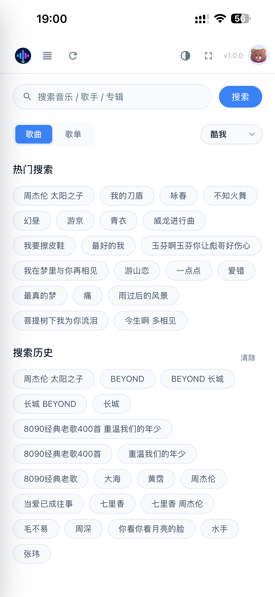
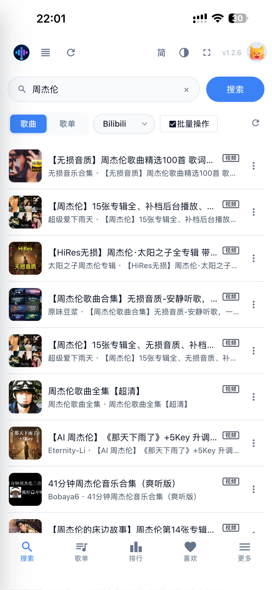
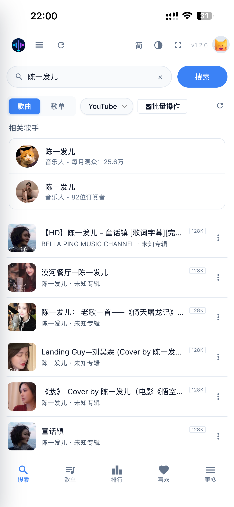
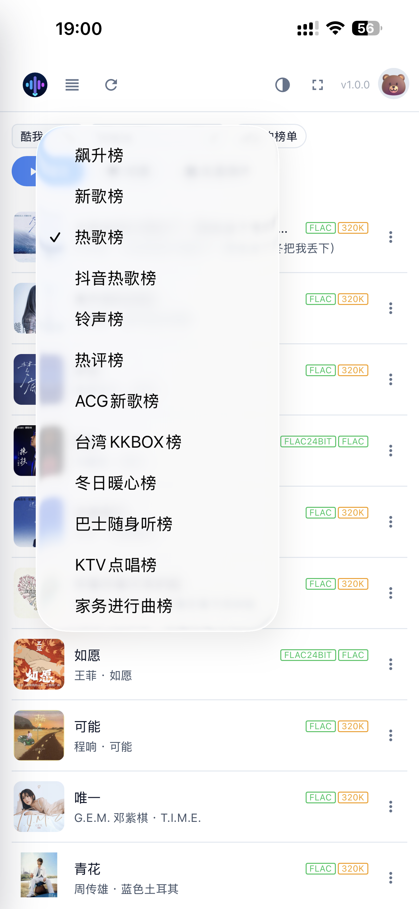
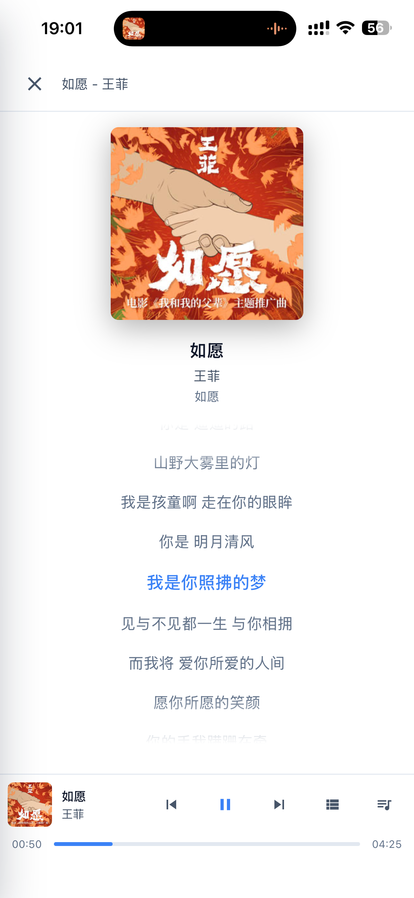
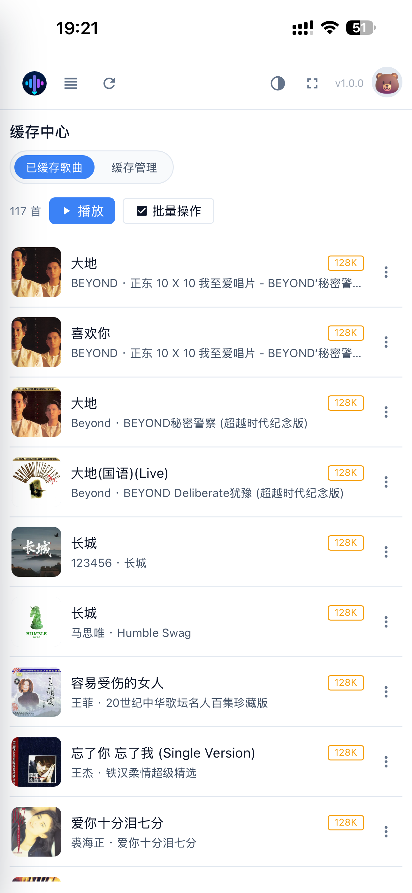
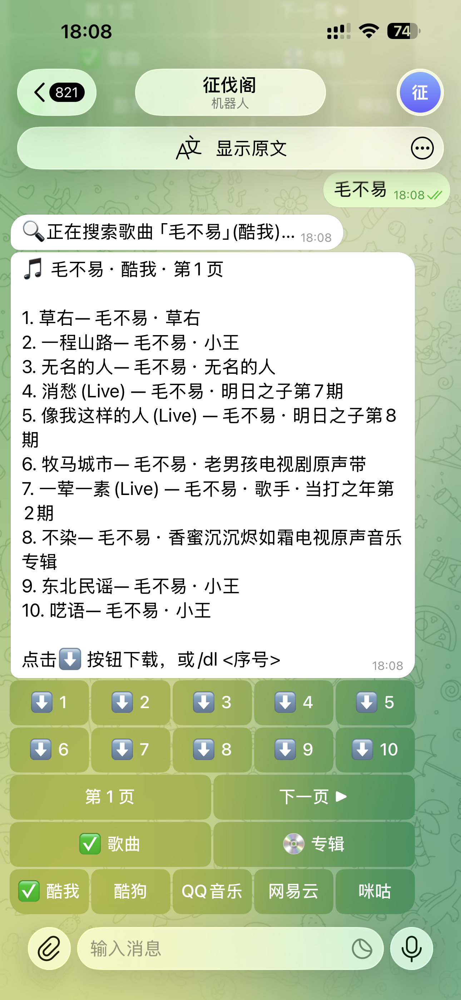
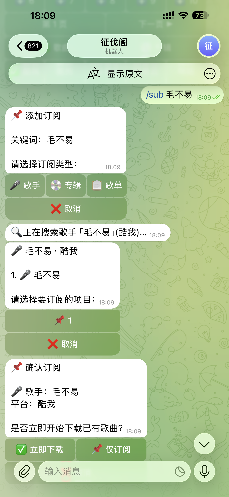
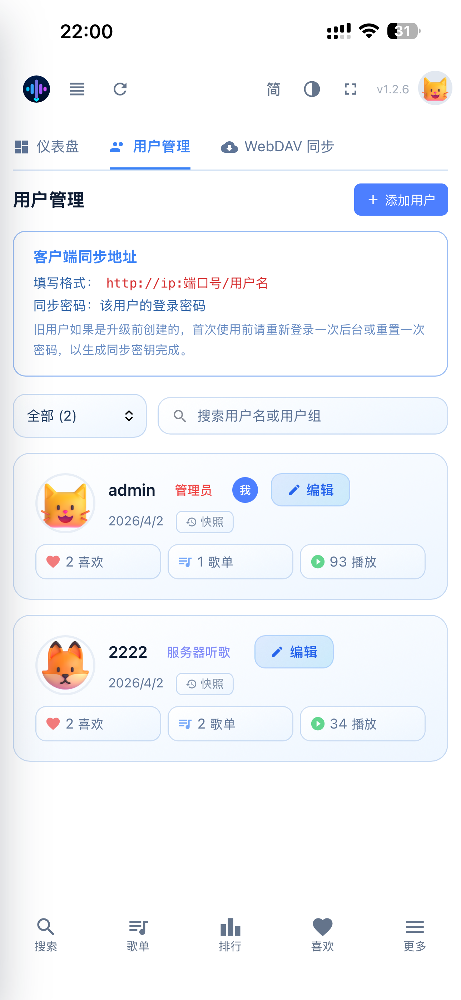
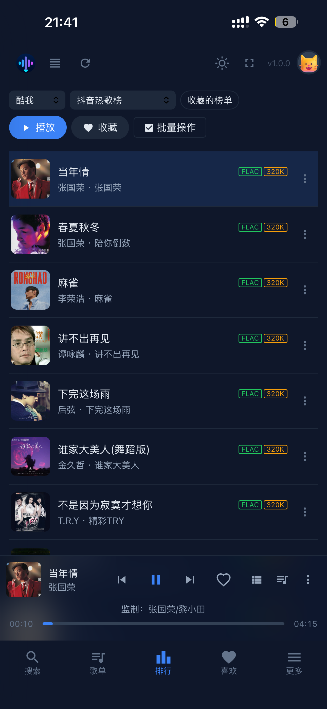

<p align="center">
  
</p>

<h1 align="center">MusicSync</h1>

<p align="center">
  自托管、多用户、支持 LX Music 同步、OpenSubsonic 与本地音乐库管理的 Web 音乐聚合服务
</p>

<p align="center">
  <a href="https://github.com/lincolnpark2000/MusicSync/releases"></a>
  <a href="https://hub.docker.com/r/lincolnpark2000/musicsync"></a>
  <a href="./LICENSE"></a>
</p>

MusicSync 是一个以 Docker 部署为主的自托管音乐服务。它既可以作为浏览器中的独立音乐播放器，也可以作为 LX Music 客户端的数据同步服务，并为兼容 Subsonic / OpenSubsonic 的客户端提供音乐库访问能力。最新代码还加入了本地音乐库：可以扫描服务器挂载目录中的音频文件，按歌曲、专辑、歌手管理，并支持播放、刮削元数据、整理文件和 Web 端操作。

项目本身不内置、不提供任何音乐播放源。在线音乐播放地址需要由用户自行配置兼容 LX Music 协议的第三方自定义源；本地音乐功能则读取你自己挂载到服务器或容器中的音频文件。


## 主要特性

### 音乐搜索与浏览

- 支持酷我、酷狗、QQ 音乐、网易云、咪咕、Bilibili、YouTube Music 等平台搜索。
- 支持多平台聚合搜索、热搜、搜索历史和多源自动切换。
- 支持排行榜、分类歌单、YouTube Music 官方心情 / 活动 / 流派歌单。
- 支持歌手详情、专辑详情、相关歌曲和高清封面。
- 支持收藏歌曲、歌单、歌手、专辑，并创建和管理自己的歌单。

### 本地音乐库

- 支持通过 `LOCAL_MUSIC_DIRS` 挂载一个或多个服务器本地音乐目录。
- 支持扫描 MP3、FLAC、M4A、AAC、OGG、OPUS、WAV、APE 等常见音频格式。
- 支持按歌曲、专辑、歌手浏览本地音乐，并按挂载目录、格式、码率和刮削状态筛选。
- 支持读取内嵌封面、内嵌元数据和同目录 `.lrc` / `.txt` 歌词。
- 支持本地文件在线播放、拖动进度、读取本地歌词和封面。
- 支持单曲或批量刮削元数据，可写入歌曲名、歌手、专辑、封面和歌词。
- 支持按模板整理文件目录和文件名，也可在确认开启后从 Web 端删除本地文件。
- 支持自动扫描、空闲自动刮削、播放时自动刮削和防风控间隔控制。

### 播放器与歌词

- 支持多种播放器样式、播放队列、循环 / 随机播放和歌词同步滚动。
- 支持歌词卡片分享、封面展示和歌曲详情补全。
- 支持系统 Media Session / SMTC 媒体控制，并可在系统媒体控制栏显示当前歌词。
- 支持锁屏或切换后台时暂停播放，回到前台后自动恢复。
- 支持按播放时长或播放歌曲数设置睡眠定时关闭。
- 支持深色模式、浅色模式、响应式移动端页面和 PWA 安装。

### 下载与缓存

- 支持浏览器下载和服务器落盘下载。
- 支持单曲、批量下载以及下载前确认下载方式、音质和歌词文件。
- 支持 `128k`、`320k`、`FLAC`、`FLAC24BIT` 等音质选择与质量替换策略。
- 支持下载队列、实时进度、速度、状态管理和完成记录。
- 支持为下载文件嵌入歌曲元数据与封面，并校验异常文件和版权提示音。
- 支持浏览器缓存与服务器缓存，提供缓存索引、命名模板、容量限制和自动清理。
- YouTube Music 音频可通过后端集成的 `yt-dlp` 解析和下载。

### 订阅与自动化

- 支持订阅歌手、专辑和歌单。
- 支持定时检查、手动检查、后台异步扫描和发现新歌后自动下载。
- 支持扫描并发、下载并发、新增歌曲策略和音质升级策略。
- 支持查看订阅运行状态、扫描进度、歌曲列表和下载结果。

### 多用户、权限与同步

- 支持多用户登录，每位用户拥有独立的收藏、歌单、历史、下载、订阅和设置。
- 支持用户组和细粒度权限，包括播放、历史、歌单、同步、自定义源、下载、缓存、设置和服务器管理。
- 支持 LX Music 客户端歌单同步。
- 支持 Subsonic / OpenSubsonic 常用接口，可连接音流、Symfonium 等兼容客户端。
- 支持播放历史、歌单、收藏、歌手、专辑、封面、歌词、搜索和串流等 Subsonic 能力。

### 界面管理与数据安全

- 管理员可在“设置中心 → 界面管理”调整侧栏菜单、设置中心入口、GitHub 菜单项和部分页面文案。
- 界面管理配置会写入 `data/ui-config.json`，并生成备份文件。
- 支持用户数据导入、导出和用户级 WebDAV 同步。
- 支持管理员全局 WebDAV 备份、恢复、远程备份列表和定时自动备份。
- WebDAV 与全局备份可包含界面管理配置，恢复后全站入口与页面文案会同步恢复。
- 支持用户快照，恢复快照前会自动创建保护性备份。

### 通知、部署与更新

- 支持 Telegram Bot 搜索、下载、订阅和手动触发订阅检查。
- 支持 Telegram、Server 酱和 PushPlus 通知。
- 支持登录提醒、订阅进度、新歌发现和下载完成等事件通知。
- 支持 Docker / Docker Compose 部署，提供 AMD64 与 ARM64 镜像发布脚本。
- 支持自定义数据、下载、缓存和本地音乐目录，适合挂载到 SSD 或 NAS。
- 支持 HTTP / HTTPS 代理、用户自定义源代理和域名分流。
- 页面启动时自动检查 GitHub Release；支持稍后提醒和立即查看。

## 页面预览

<table width="100%">
  <tr>
    <td width="25%" align="center" valign="top">
      <br>
      <sub><b>搜索首页</b></sub>
    </td>
    <td width="25%" align="center" valign="top">
      <br>
      <sub><b>Bilibili 搜索</b></sub>
    </td>
    <td width="25%" align="center" valign="top">
      <br>
      <sub><b>YouTube Music</b></sub>
    </td>
    <td width="25%" align="center" valign="top">
      <br>
      <sub><b>排行榜</b></sub>
    </td>
  </tr>
  <tr>
    <td width="25%" align="center" valign="top">
      <br>
      <sub><b>歌单浏览</b></sub>
    </td>
    <td width="25%" align="center" valign="top">
      <br>
      <sub><b>锁屏界面</b></sub>
    </td>
    <td width="25%" align="center" valign="top">
      <br>
      <sub><b>歌词页面</b></sub>
    </td>
    <td width="25%" align="center" valign="top">
      <br>
      <sub><b>缓存中心</b></sub>
    </td>
  </tr>
  <tr>
    <td width="25%" align="center" valign="top">
      <br>
      <sub><b>Telegram 搜索下载</b></sub>
    </td>
    <td width="25%" align="center" valign="top">
      <br>
      <sub><b>Telegram 添加订阅</b></sub>
    </td>
    <td width="25%" align="center" valign="top">
      <br>
      <sub><b>多用户与服务器同步</b></sub>
    </td>
    <td width="25%" align="center" valign="top">
      <br>
      <sub><b>深色模式</b></sub>
    </td>
  </tr>
</table>

## Docker 快速部署

### Docker Compose

创建 `docker-compose.yml`：

```yaml
services:
  musicsync:
    image: lincolnpark2000/musicsync:latest
    container_name: musicsync
    restart: unless-stopped
    ports:
      - "5566:5566"
    environment:
      - PORT=5566
      - NODE_ENV=production
      - DATA_DIR=/app/data
      - DOWNLOAD_DIR=/app/downloads
      - CACHE_DIR=/app/cache
      - LOCAL_MUSIC_DIRS=/app/music/library1,/app/music/library2
      - JWT_SECRET=请替换为随机长字符串
      - JSON_BODY_LIMIT=8mb
    volumes:
      - ./data:/app/data
      - ./downloads:/app/downloads
      - ./cache:/app/cache
      - /path/to/your/music1:/app/music/library1
      - /path/to/your/music2:/app/music/library2
```

启动服务：

```bash
docker compose up -d
```

浏览器访问：

```text
http://服务器IP:5566
```

首次启动会创建默认管理员：

```text
用户名：admin
密码：admin
```

登录后请立即修改默认密码。

### ARM64 部署

ARM64 设备可使用独立标签：

```yaml
image: lincolnpark2000/musicsync:latest-arm64
```

版本标签格式为：

```text
lincolnpark2000/musicsync:v版本号-arm64
```

## 首次使用

1. 使用默认管理员登录并修改密码。
2. 打开“设置中心 → 扩展设置”，导入兼容 LX Music 协议的自定义源。
3. 按需要配置默认音质、缓存策略、下载目录、订阅行为和代理。
4. 如果要管理服务器本地音乐，在 Docker 中挂载音乐目录，并设置 `LOCAL_MUSIC_DIRS`。
5. 打开“本地音乐”，点击“扫描”生成本地音乐库索引。
6. 需要补齐本地歌曲信息时，进入“本地音乐 → 刮削设置”配置刮削平台、写入内容和整理规则。
7. 需要远程通知时，配置 Telegram 或微信推送。
8. 需要多端同步时，配置 LX Music、WebDAV 或 Subsonic 客户端。

## 本地音乐库

本地音乐功能读取服务器或容器内的真实文件。推荐把宿主机音乐目录映射到容器内部路径，再把这些容器路径写入 `LOCAL_MUSIC_DIRS`。

示例：

```yaml
environment:
  - LOCAL_MUSIC_DIRS=华语=/app/music/cn,无损=/app/music/lossless
volumes:
  - /mnt/music/cn:/app/music/cn
  - /mnt/music/lossless:/app/music/lossless
```

进入“本地音乐”后：

1. 点击“扫描”读取挂载目录中的音频文件。
2. 在“歌曲 / 专辑 / 歌手”之间切换视图。
3. 使用筛选面板按格式、码率、刮削状态过滤。
4. 在“刮削设置”里选择刮削平台、写入字段、歌词保存方式和整理模板。
5. 批量选择歌曲后，可执行播放、刮削、整理等操作。

删除本地文件是高风险操作，默认关闭。只有在“刮削设置”中开启“允许前端删除歌曲”后，歌曲更多操作里才会出现删除入口。

## 界面管理

管理员可进入“设置中心 → 界面管理”调整全站入口：

- 主菜单：控制侧栏入口的显示、隐藏、顺序和显示位置。
- 设置中心入口：控制设置首页卡片的显示、分组、顺序、名称和描述。
- 页面文案：部分页面可进入编辑器修改展示文案。
- 头像菜单 GitHub 项：可改文字、链接或隐藏。

界面配置对所有用户生效，但权限系统仍然保留。用户没有对应权限时，即使菜单被配置为可见，也不会看到或访问该入口。

## LX Music 客户端同步

MusicSync 可以作为 LX Music 客户端的同步服务端。

| 配置项 | 内容 |
|---|---|
| 同步地址 | `http://服务器IP:5566/用户名` |
| 同步密码 | 当前用户的登录密码 |

如果旧用户无法同步，请在网页中重新修改一次密码，使服务端生成最新同步凭据。

## Subsonic / OpenSubsonic

兼容客户端可使用以下配置：

| 配置项 | 内容 |
|---|---|
| 服务地址 | `http://服务器IP:5566` |
| 用户名 | MusicSync 用户名 |
| 密码 | MusicSync 用户密码 |

服务端入口为 `/rest/*`，支持常用歌单、收藏、歌手、专辑、歌词、封面、搜索、播放记录与音频串流接口。

## Telegram Bot

在“设置中心 → 通知管理”中配置 Bot Token 和 Chat ID 后，可以接收通知并使用机器人操作 MusicSync。

常用命令示例：

```text
/start
/help
/search 周杰伦 稻香
/download 周杰伦 稻香
/sub 歌手 Taylor Swift
/sub_list
/sub_check
```

## 常用环境变量

| 环境变量 | 默认值 | 说明 |
|---|---:|---|
| `PORT` | `5566` | 服务监听端口 |
| `APP_VERSION` | `v1.0.0` | 当前应用版本，用于页面展示和更新检查 |
| `DATA_DIR` | `/app/data` | 用户、配置、快照、本地音乐索引等数据目录 |
| `DOWNLOAD_DIR` | `/app/downloads` | 服务器下载目录 |
| `CACHE_DIR` | `/app/cache` | 服务器音频缓存目录 |
| `LOCAL_MUSIC_DIRS` | 空 | 本地音乐挂载目录，多个路径用英文逗号或分号分隔 |
| `LOCAL_MUSIC_PATHS` | 空 | `LOCAL_MUSIC_DIRS` 的兼容别名 |
| `JWT_SECRET` | 内置默认值 | JWT 密钥，公网部署必须修改 |
| `JSON_BODY_LIMIT` | `8mb` | JSON 请求体大小限制 |
| `USER_API_AUTO_REFRESH` | `1` | 是否定时刷新自定义源 |
| `USER_API_AUTO_REFRESH_ON_BOOT` | `1` | 启动时是否刷新自定义源 |
| `USER_API_AUTO_REFRESH_INTERVAL_MINUTES` | `180` | 自定义源刷新间隔 |
| `USER_API_VERBOSE_LOGS` | `0` | 是否输出自定义源调试日志 |
| `USER_API_PROXY` | 空 | 自定义源、YouTube 等服务使用的代理 |
| `USER_API_PROXY_MODE` | `china_whitelist` | 代理分流模式 |
| `USER_API_PROXY_DOMAINS` | 空 | 额外需要代理的域名 |
| `HTTP_PROXY` / `HTTPS_PROXY` | 空 | 进程级 HTTP / HTTPS 代理 |
| `NO_PROXY` | 空 | 代理绕过列表 |
| `UPDATE_CHECK_REPOSITORY` | `lincolnpark2000/MusicSync` | 自动更新检查使用的 GitHub 仓库 |
| `UPDATE_CHECK_CACHE_TTL_MS` | `900000` | Release 检查缓存时间 |
| `GITHUB_TOKEN` | 空 | 可选，用于提高 GitHub API 限额 |

## 数据目录

建议将数据、下载、缓存和本地音乐目录分别持久化：

```yaml
volumes:
  - /your/path/musicsync/data:/app/data
  - /your/path/musicsync/downloads:/app/downloads
  - /your/path/musicsync/cache:/app/cache
  - /your/path/music:/app/music
```

常见数据文件：

| 路径 | 说明 |
|---|---|
| `data/users.json` | 用户数据 |
| `data/groups.json` | 用户组和权限 |
| `data/ui-config.json` | 界面管理配置 |
| `data/local_music_index.json` | 本地音乐索引 |
| `data/local_music_covers/` | 本地音乐封面缓存 |
| `data/users/*/` | 用户级歌单、收藏、历史、订阅、下载记录等 |
| `downloads/` | 服务器落盘下载文件 |
| `cache/` | 服务器音频缓存 |

升级容器不会影响已挂载的数据。执行重要升级或迁移前，建议先在管理后台创建快照或执行 WebDAV 全局备份。

## 自定义源与版权说明

- MusicSync 不提供、不内置、不分发任何受版权保护的音乐内容或播放源。
- 自定义源、代理和相关内容由用户自行配置，使用者应自行判断其合法性与合规性。
- 本地音乐功能只管理用户自行挂载的文件，文件来源、版权和使用方式由用户自行负责。
- 请遵守所在地法律法规并支持正版音乐。
- 本项目仅用于学习、研究和个人技术实践。

## 相关链接

- GitHub Releases：<https://github.com/lincolnpark2000/MusicSync/releases>
- Docker Hub：<https://hub.docker.com/r/lincolnpark2000/musicsync>
- 详细更新日志：[v1.3.8 到当前代码](./CHANGELOG_v1.3.8_to_current.md)

## License

[MIT](./LICENSE)
